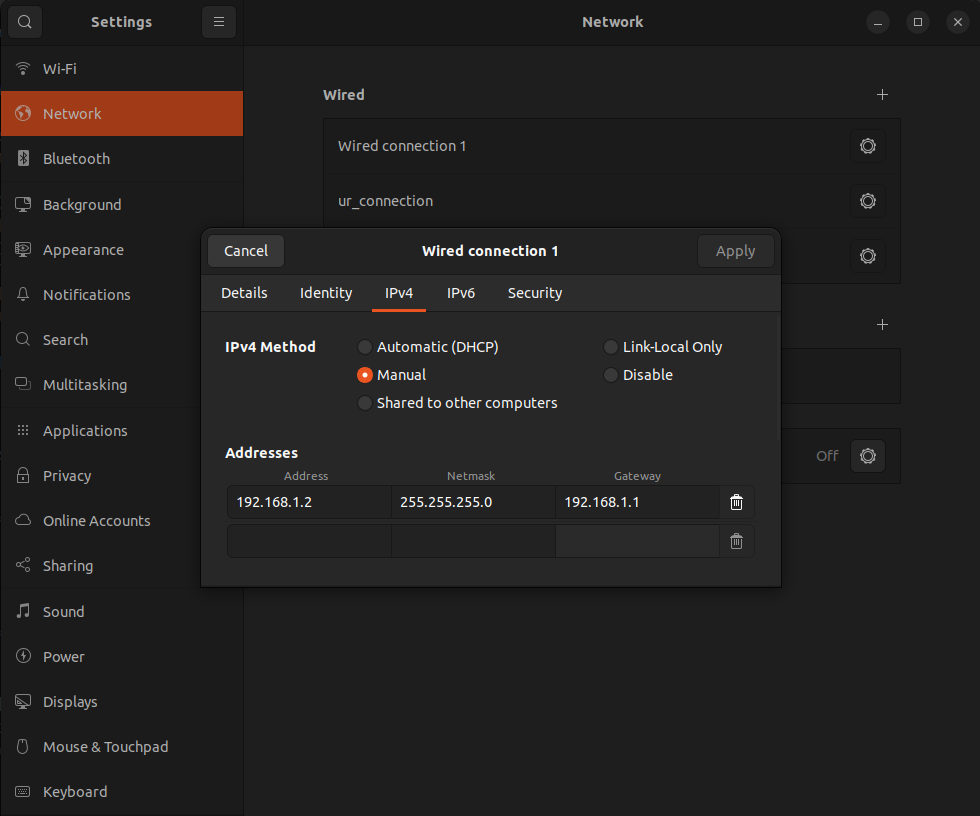
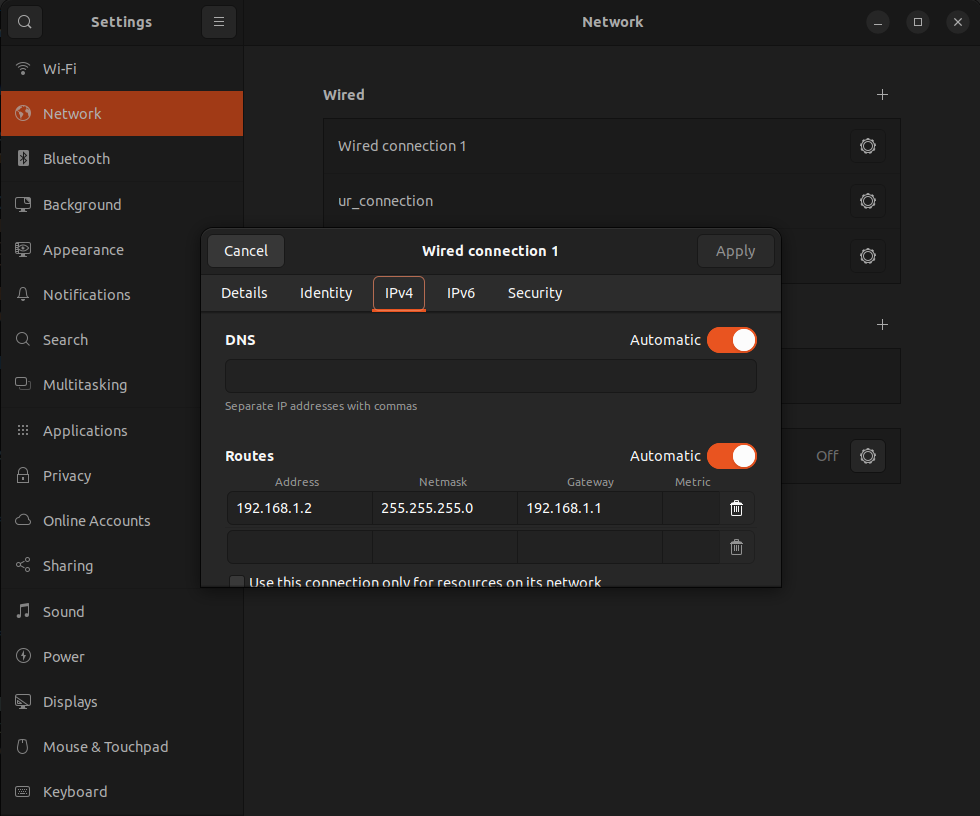

# xArm7 Tutorial

This is a guide on how to control xArm7 usin MoveIt. Before starting the tutorial you should first install all of the necessary stuff from the Prerequisites section.

## Instructions:
* [Establish Network Connection](#establish-network-connection)
* [Install xArm ROS2 Driver](#install-xarm-ros2-driver)
* [Test xArm Driver](#test-xarm-driver)
* [Running A Sample Code](#running-a-sample-code)

## Prerequisites
 * [Moveit](https://moveit.ros.org/install-moveit2/binary/)


## **Establish Network Connection**

First connect xArm7 ethernet cable to your laptop, then open Settings->Network->Wired Connection and make following changes:

<br>
<br>

## **Install xArm ROS2 Driver** 
### 1. Create workspace

```bash
mkdir -p colcon_ws/src
cd colcon_ws/src
```
### 2. Clone repository

```bash
git clone https://github.com/xArm-Developer/xarm_ros2.git --recursive -b $ROS_DISTRO
cd xarm_ros2
git pull
git submodule sync
git submodule update --init --remote
```

### 3. Install dependencies

```bash
cd colcon_ws/src
rosdep update
rosdep install --from-paths . --ignore-src --rosdistro $ROS_DISTRO -y
cd colcon_ws
colcon build
source install/setup.bash 
```

## **Test xArm Driver** 

<br>**For work with fake hardware:**

```bash
ros2 launch xarm_moveit_config xarm7_moveit_realmove.launch.py add_gripper:=true robot_ip:=xxx.xxx.x.xxx 
```
<br>**For work with real robot:**

```bash
ros2 launch xarm_moveit_config xarm7_moveit_fake.launch.py add_gripper:=true robot_ip:=xxx.xxx.x.xxx 
``` 

## **Running A Sample Code**

To be able to run demo.cpp we need to make some changes to xarm_ros2 driver. For that navigate to xarm_ros2->xarm_moveit_config->launch and open _robot_moveit_common.launch.py. In that file find this part of code:

```bash
# Start the actual move_group node/action server
move_group_node = Node(
    package='moveit_ros_move_group',
    executable='move_group',
    output='screen',
    parameters=[
        robot_description_parameters,
        ompl_planning_pipeline_config,
        trajectory_execution,
        plan_execution,
        moveit_controllers,
        planning_scene_monitor_parameters,
        {'use_sim_time': use_sim_time},
    ],
)
```
And change it to this:

```bash
# Start the actual move_group node/action server
move_group_node = Node(
    package='moveit_ros_move_group',
    executable='move_group',
    output='screen',
    parameters=[
        robot_description_parameters,
        ompl_planning_pipeline_config,
        trajectory_execution,
        plan_execution,
        moveit_controllers,
        planning_scene_monitor_parameters,
        {'use_sim_time': use_sim_time,
         'publish_robot_description': True,
         'publish_robot_description_semantic': True
        },
    ],
)
```
Save the file and build xarm_moveit_config package:

```bash
cd colcon_ws
colcon build --packages-select xarm_moveit_config
```

### 1. Clone this repository

```bash
cd colcon_ws/src
git clone https://github.com/patsyuk03/xArm7Tutorial.git
cd ..
colcon build --packages-select xarm_demo
source install/setup.bash 
```

### 2. Launch PnP demo
<br>**For work with fake hardware:** 

```bash
ros2 launch xarm_demo demo.launch.py use_fake_hardware:=true
```

<br>**For work with real robot:**

```bash
ros2 launch xarm_demo demo.launch.py use_fake_hardware:=false
```